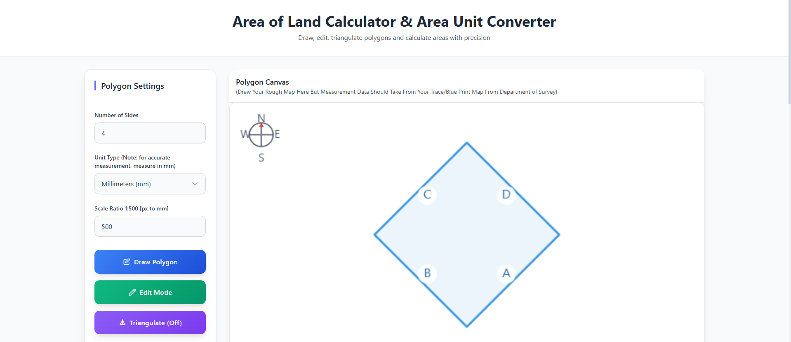

# Land Area Calculator & Unit Converter 🏞️

**Interactive web tool for drawing polygons, calculating land area accurately (even complex shapes), and converting between modern + traditional Nepali land units.**

<p align="center">
  
  <br/><em>(Replace with actual screenshot later)</em>
</p>


## ✨ Features

### 📐 Polygon Drawing & Area Calculation
- Interactive HTML5 Canvas – draw & edit polygons (3–12 sides)
- Real-time visualization + vertex drag-and-drop editing
- Automatic **triangulation** for accurate area of complex/concave polygons
- Side & diagonal labeling (A, B, C…)
- Custom scale ratio (pixel → real-world unit)
- Input actual side lengths in **mm** or **cm**
- Auto-conversion to ground length in **feet**
- Input validation + triangle inequality checks

### 📏 Unit Converter (with Nepali focus)
- **Standard**: m² ↔ ft²
- **Terai Region** (Bigha–Katha–Dhur)  
  1 Bigha = 20 Katha = 400 Dhur ≈ **6772.63 m²**
- **Hill Region** (Ropani–Anna–Paisa–Daam)  
  1 Ropani = 16 Anna = 64 Paisa = 256 Daam ≈ **508.74 m²**
- Real-time bidirectional conversion
- One-click transfer of calculated polygon area to converter

### 🎨 UI/UX
- Fully responsive (mobile + desktop)
- Color-coded sides/diagonals + compass orientation
- Smooth animations & hover effects
- Export results table + canvas snapshot as PNG
- Clean, modern Tailwind-styled interface

## 🛠️ Technologies
- React 18.2+
- Tailwind CSS
- HTML5 Canvas
- html2canvas (for export)
- Modern JavaScript (ES6+)

## 📋 Prerequisites
- Node.js ≥ 14
- npm or yarn
- Modern browser (Chrome, Firefox, Edge, Safari)

## 🚀 Installation & Running

1. Clone the repo
   ```bash
   git clone https://https://github.com/udaytharu/land-area-calculator/tree/main/land-area-calculator
  
    cd land-area-calculator

# Install dependencies
    npm install html2canvas
    npm install -D tailwindcss autoprefixer postcss

# Start or Run
    npm run dev
